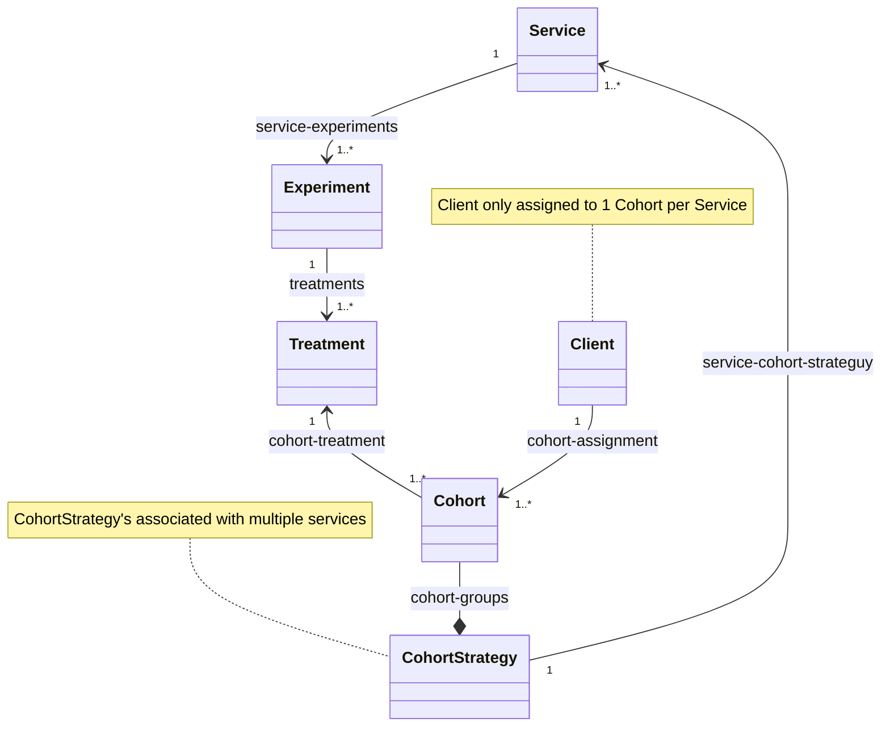

# Experiment/Request Router for web services
Reference implementation for Experiment/Treatment routing of requests to backend services.

## Information Model

## User Stories - Experiment request routing
*As a* service owner,  
*I want* to be able to deterministically route service requests to different treatments based on the requestor,  
*So that* I can run experiments using different treatments for differing customers.

### User Scenarios
Feature: Service Request Treatment Routing  
Routing service requests to different experimental treatments based on the client making the request.

Background:  
    * Given a service "svc-a" with treatments "t1" and "t2"  
        - And a client "r1" with client-id "1234"  
        - And a client "r2" with client-id "9876"  
        - And client "r1" is assigned to cohort "c1"  
        - And client "r2" is assigned to cohort "c2"  
        - And cohort "c1" is assigned to service treatment "c1"  
        - And cohort "c2" is assigned to service treatment "c2"

Scenario: Service request from "r1" with treatment "t1"  
    * Given I am making a request as client "r1"  
    * When I submit a GET request to "/services/svc-a?client-id=1234"  
    * Then the request is serviced using treatment "t1"

Scenario: Service request from "r2" with treatment "t2"  
    * Given I am making a request as client "r2"  
    * When I submit a GET request to "/services/svc-a?client-id=9876"  
    * Then the request is serviced using treatment "t2"

Scenario: Request id added as header field  
    * Given I make a request as client "r1"  
    * When I submit a GET request to "/services/svc-a?client-id=1234"  
    * Then a 'X-Request-ID' header field is added to the request response,  
    * And the 'X-Request-ID' header field value is a uuid.